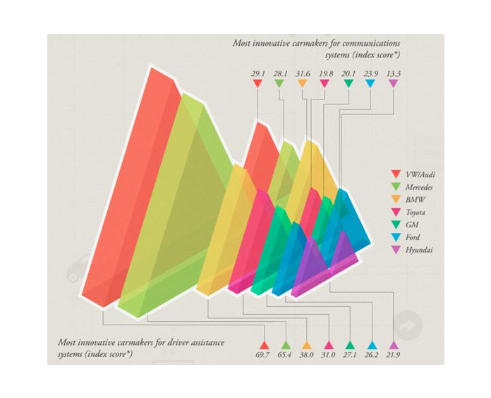

Title: My Second Blog
Date: 2020-01-01 11:35
Slug: blog2


```python
from IPython.core.display import HTML
import pandas as pd
import numpy as np
import matplotlib.pyplot as plt
from IPython.display import Image
from IPython.core.display import HTML
from PIL import Image, ImageOps
import numpy as np
import seaborn as sns
import altair as alt
%matplotlib inline
```



##### ***How to show the data I have in a best effective way?***
<p>***Any data can be visualize by more then one different ways. Lots of times process will be iterative, looking at data from different angles, finally discovering the view which will be most effective visual.***</p>  
##### ***Would be Charts better solution for the above visualization?***
<p>***Charts are perfect for comparing one or many value sets, and they can easily show the low and high values in the data sets. They are great for categorical data, they are widely used and easy to understand.***</p>


```python
df = pd.DataFrame([
    ['Audi', 29.1, 69.7],
    ['Mercedes', 28.1, 65.4],
    ['BMW', 31.4, 38.0],
    ['Toyota', 19.8, 31.0],
    ['GM', 20.1, 27.1],
    ['Ford', 23.9, 26.2],
    ['Hyundai', 13.3, 21.9]
], columns=['Carmaker', 'Communication_Index', 'Driver_Assistanse_Index'])
```


```python
bar = alt.Chart(df,title=f"Most Innovative Carmakers", width=10, height=600).mark_bar().encode(
    x=alt.X('Driver_Assistanse_Index:Q', axis = None), 
    y=alt.Y('Communication_Index:O', sort=alt.EncodingSortField(field = 'Communication_Index',op = 'sum', order='descending')),
    color=alt.Color('Carmaker')
).properties(
    width=500,
    height=100
)

text = alt.Chart(df).mark_text(dx= 11, dy= 1, color='black').encode(
    x=alt.X('Driver_Assistanse_Index:Q'),
    y=alt.Y('Communication_Index:O', sort=alt.EncodingSortField(field = 'Communication_Index',op = 'sum', order='descending')),
    detail='Carmaker:N',
    text=alt.Text('Driver_Assistanse_Index:N', format='.1f')
)
bar + text
```


<div id="altair-viz-1"></div>
<script type="text/javascript">
  (function(spec, embedOpt){
    const outputDiv = document.getElementById("altair-viz-1");
    const paths = {
      "vega": "https://cdn.jsdelivr.net/npm//vega@5?noext",
      "vega-lib": "https://cdn.jsdelivr.net/npm//vega-lib?noext",
      "vega-lite": "https://cdn.jsdelivr.net/npm//vega-lite@4.0.0?noext",
      "vega-embed": "https://cdn.jsdelivr.net/npm//vega-embed@6?noext",
    };

    function loadScript(lib) {
      return new Promise(function(resolve, reject) {
        var s = document.createElement('script');
        s.src = paths[lib];
        s.async = true;
        s.onload = () => resolve(paths[lib]);
        s.onerror = () => reject(`Error loading script: ${paths[lib]}`);
        document.getElementsByTagName("head")[0].appendChild(s);
      });
    }

    function showError(err) {
      outputDiv.innerHTML = `<div class="error" style="color:red;">${err}</div>`;
      throw err;
    }

    function displayChart(vegaEmbed) {
      vegaEmbed(outputDiv, spec, embedOpt)
        .catch(err => showError(`Javascript Error: ${err.message}<br>This usually means there's a typo in your chart specification. See the javascript console for the full traceback.`));
    }

    if(typeof define === "function" && define.amd) {
      requirejs.config({paths});
      require(["vega-embed"], displayChart, err => showError(`Error loading script: ${err.message}`));
    } else if (typeof vegaEmbed === "function") {
      displayChart(vegaEmbed);
    } else {
      loadScript("vega")
        .then(() => loadScript("vega-lite"))
        .then(() => loadScript("vega-embed"))
        .catch(showError)
        .then(() => displayChart(vegaEmbed));
    }
  })({"config": {"view": {"continuousWidth": 400, "continuousHeight": 300}}, "layer": [{"mark": "bar", "encoding": {"color": {"type": "nominal", "field": "Carmaker"}, "x": {"type": "quantitative", "axis": null, "field": "Driver_Assistanse_Index"}, "y": {"type": "ordinal", "field": "Communication_Index", "sort": {"field": "Communication_Index", "op": "sum", "order": "descending"}}}, "height": 100, "title": "Most Innovative Carmakers", "width": 500}, {"mark": {"type": "text", "color": "black", "dx": 11, "dy": 1}, "encoding": {"detail": {"type": "nominal", "field": "Carmaker"}, "text": {"type": "nominal", "field": "Driver_Assistanse_Index", "format": ".1f"}, "x": {"type": "quantitative", "field": "Driver_Assistanse_Index"}, "y": {"type": "ordinal", "field": "Communication_Index", "sort": {"field": "Communication_Index", "op": "sum", "order": "descending"}}}}], "data": {"name": "data-bba76fe2c24e2879bf78d76a849935a0"}, "$schema": "https://vega.github.io/schema/vega-lite/v4.0.0.json", "datasets": {"data-bba76fe2c24e2879bf78d76a849935a0": [{"Carmaker": "Audi", "Communication_Index": 29.1, "Driver_Assistanse_Index": 69.7}, {"Carmaker": "Mercedes", "Communication_Index": 28.1, "Driver_Assistanse_Index": 65.4}, {"Carmaker": "BMW", "Communication_Index": 31.4, "Driver_Assistanse_Index": 38.0}, {"Carmaker": "Toyota", "Communication_Index": 19.8, "Driver_Assistanse_Index": 31.0}, {"Carmaker": "GM", "Communication_Index": 20.1, "Driver_Assistanse_Index": 27.1}, {"Carmaker": "Ford", "Communication_Index": 23.9, "Driver_Assistanse_Index": 26.2}, {"Carmaker": "Hyundai", "Communication_Index": 13.3, "Driver_Assistanse_Index": 21.9}]}}, {"mode": "vega-lite"});
</script>


#####  ***There is another, more interactive way of data visualization, created using Altair.***
<p>***In Altair Data sets most commonly provided as pandas DataFrame, and columns would be essential pieces of plotting.***</p>


```python
(
    alt.Chart(df)
    .mark_circle(opacity=0.9)
    .encode(x='Driver_Assistanse_Index', y='Communication_Index', color='Carmaker:N', tooltip=['Carmaker', 'Communication_Index','Driver_Assistanse_Index' ])
    .interactive()
).properties(
    width=500,
    height=300,
    title='Most Innovative Carmakers'
).configure_axis(
    labelFontSize=8,
    titleFontSize=12
)

```


<div id="altair-viz-2"></div>
<script type="text/javascript">
  (function(spec, embedOpt){
    const outputDiv = document.getElementById("altair-viz-2");
    const paths = {
      "vega": "https://cdn.jsdelivr.net/npm//vega@5?noext",
      "vega-lib": "https://cdn.jsdelivr.net/npm//vega-lib?noext",
      "vega-lite": "https://cdn.jsdelivr.net/npm//vega-lite@4.0.0?noext",
      "vega-embed": "https://cdn.jsdelivr.net/npm//vega-embed@6?noext",
    };

    function loadScript(lib) {
      return new Promise(function(resolve, reject) {
        var s = document.createElement('script');
        s.src = paths[lib];
        s.async = true;
        s.onload = () => resolve(paths[lib]);
        s.onerror = () => reject(`Error loading script: ${paths[lib]}`);
        document.getElementsByTagName("head")[0].appendChild(s);
      });
    }

    function showError(err) {
      outputDiv.innerHTML = `<div class="error" style="color:red;">${err}</div>`;
      throw err;
    }

    function displayChart(vegaEmbed) {
      vegaEmbed(outputDiv, spec, embedOpt)
        .catch(err => showError(`Javascript Error: ${err.message}<br>This usually means there's a typo in your chart specification. See the javascript console for the full traceback.`));
    }

    if(typeof define === "function" && define.amd) {
      requirejs.config({paths});
      require(["vega-embed"], displayChart, err => showError(`Error loading script: ${err.message}`));
    } else if (typeof vegaEmbed === "function") {
      displayChart(vegaEmbed);
    } else {
      loadScript("vega")
        .then(() => loadScript("vega-lite"))
        .then(() => loadScript("vega-embed"))
        .catch(showError)
        .then(() => displayChart(vegaEmbed));
    }
  })({"config": {"view": {"continuousWidth": 400, "continuousHeight": 300}, "axis": {"labelFontSize": 8, "titleFontSize": 12}}, "data": {"name": "data-bba76fe2c24e2879bf78d76a849935a0"}, "mark": {"type": "circle", "opacity": 0.9}, "encoding": {"color": {"type": "nominal", "field": "Carmaker"}, "tooltip": [{"type": "nominal", "field": "Carmaker"}, {"type": "quantitative", "field": "Communication_Index"}, {"type": "quantitative", "field": "Driver_Assistanse_Index"}], "x": {"type": "quantitative", "field": "Driver_Assistanse_Index"}, "y": {"type": "quantitative", "field": "Communication_Index"}}, "height": 300, "selection": {"selector001": {"type": "interval", "bind": "scales", "encodings": ["x", "y"]}}, "title": "Most Innovative Carmakers", "width": 500, "$schema": "https://vega.github.io/schema/vega-lite/v4.0.0.json", "datasets": {"data-bba76fe2c24e2879bf78d76a849935a0": [{"Carmaker": "Audi", "Communication_Index": 29.1, "Driver_Assistanse_Index": 69.7}, {"Carmaker": "Mercedes", "Communication_Index": 28.1, "Driver_Assistanse_Index": 65.4}, {"Carmaker": "BMW", "Communication_Index": 31.4, "Driver_Assistanse_Index": 38.0}, {"Carmaker": "Toyota", "Communication_Index": 19.8, "Driver_Assistanse_Index": 31.0}, {"Carmaker": "GM", "Communication_Index": 20.1, "Driver_Assistanse_Index": 27.1}, {"Carmaker": "Ford", "Communication_Index": 23.9, "Driver_Assistanse_Index": 26.2}, {"Carmaker": "Hyundai", "Communication_Index": 13.3, "Driver_Assistanse_Index": 21.9}]}}, {"mode": "vega-lite"});
</script>


