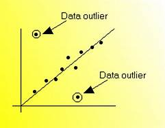
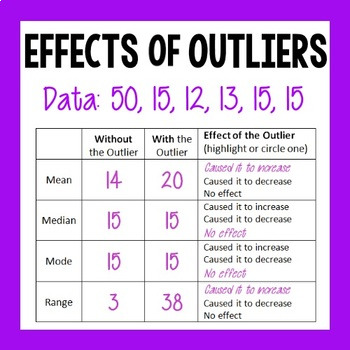
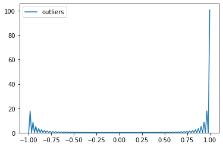

Title: My Third Blog
Date: 2020-01-21 11:35
Slug: blog3

### Outliers Detection with IsolationForest and LocalOutlierfactor.


    What are the Data Outliers?

    “Observation which deviates so much from other observations as to arouse suspicion it was generated by a different mechanism” — 
                                                        Hawkins(1980)
    
    Outliers are data points in your data with values outside of normal data population. Amount of traffic changes after the accident or winter snow storm, amount of rain falling after the huracaine, amount of internet traffic  changes during the holidays...
    The outlier is identified as the largest or smallest value in the data set. 
    




    Why do we need to investigate Outliers?

    This data point is drastically different from the rest of your data population and most parametric statistic like means, standard deviations and correlations, and all statistic based on these are highly sensitive to outliers. The outliers may be caused by data entry errors, measurements errors, experimental errors, data processing error, sampling error, natural (not an error, but novelties in data).



    How can we detect Outliers?

    
    If training data contains outliers, the detection estimators can be used to try to fit regions where the training data is the most concentrated and ignore the deviant observations.
    In the case of outlier detection, we don’t have a clean data set representing the population of regular observations that can be used to train any tool.
    
    One efficient way of performing outlier detection in datasets is to use ensemble.IsolationForest, described in scikit-learn. 
    Based on an ensemble of tree.ExtraTreeRegressor, IsolationForest ‘isolates’ observations by randomly selecting a feature and then randomly selecting a split value between the maximum and minimum values of the selected feature.


```python
import pandas as pd
from sklearn.ensemble import IsolationForest
from IPython.display import Image
from IPython.core.display import HTML
from PIL import Image, ImageOps
import numpy as np
import matplotlib.pyplot as plt
from sklearn.neighbors import LocalOutlierFactor
import seaborn as sns

```


```python
df = pd.read_csv('data/Twitter_volume_AMZN.csv')  ### internet streaming data
```


```python
df['timestamp'] = pd.to_datetime(df['timestamp'])
df.set_index('timestamp', inplace=True)#
```


```python
clf = IsolationForest(n_estimators=100, max_samples='auto', random_state= 42, contamination=.05)
clf.fit(df)
df_pred = clf.predict(df)
df['outliers']= df_pred
outliers = df.loc[df['outliers']==-1]
outlier_index = list(outliers.index)
print(df['outliers'].value_counts())
```


```python
import seaborn as sns
sns.kdeplot(df['outliers']);
```



Where the "-1" represents the outliers and "1" represents the inliers. Contamination stands for percentage of outlier points in the data.

    Another efficient way to detect outliers on high dimentional datasets is to use Local Outlier Factor (LOF) algorithm, which is defined in Scikit_learn as unsupervised anomaly detection method. 
    This algorithm computes a score (outiler factor) reflecting the degree of abnormality and measures the local deviation of density of a given sample with respect to its neighbors. Samples which have a substantially lower density considered outliers.
    The number of neighbors should be less the number of provided samples (or all of them will be used). In general n_neighbors = 20.


```python
df = pd.read_csv('data/seattleWeather_1948-2017.csv')
```


```python
df['DATE'] = pd.to_datetime(df['DATE'])
```


```python
df.set_index('DATE', inplace=True) 
```


```python
df = df.dropna()
```


```python
from pandas.plotting import register_matplotlib_converters

fig, axes = plt.subplots(nrows=3, figsize=(12,9));
axes[0].plot(df.PRCP);
axes[1].plot(df.TMAX);
axes[2].plot(df.TMIN);
```


```python
clf = LocalOutlierFactor(n_neighbors=20, contamination = 0.2)
y_pred=clf.fit_predict(df)

```


```python
n_errors = (y_pred != -1).sum()
print(n_errors)
```

    20438
    


```python
X_scores = clf.negative_outlier_factor_
print(X_scores)
```

    [-1.04002873e+00 -2.42435434e+00 -1.15581102e+00 ... -1.00000000e+09
     -1.00000000e+00 -1.00000000e+00]
    

    By changing the parameters n_neighbors and contamination level X_score can be changed.
