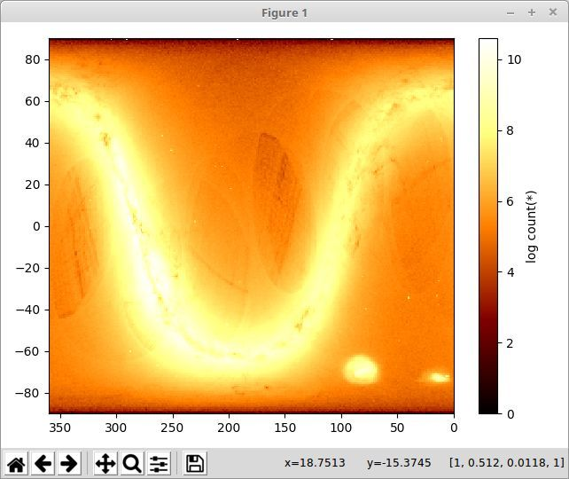
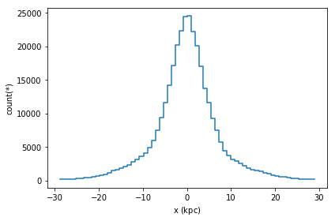
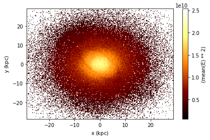

Title: My Forth Blog
Date: 2020-01-30 11:35
Slug: blog4

### Vaex - Pandas of the future....?


### What is vaex...

    Vaex is a python library for lazy Out-of-Core DataFrames (similar to Pandas), to visualize and explore big tabular datasets. It can calculate statistics such as mean, sum, count, standard deviation etc, on an N-dimensional grid up to a billion (109) objects/rows per second. Visualization is done using histograms, density plots and 3d volume rendering, allowing interactive exploration of big data. Vaex uses memory mapping, a zero memory copy policy, and lazy computations for best performance (no memory wasted).

### Why vaex...

    A few strong features of vaex are:
    
    Performance: works with huge tabular data, processes >109 rows/second
    
    Lazy / Virtual columns: compute on the fly, without wasting ram
    
    Memory efficient no memory copies when doing filtering/selections/subsets
    
    Visualization: directly supported, a one-liner is often enough
    
    User friendly API: you will only need to deal with the DataFrame object, and tab completion + docstring will help you out:     ds.mean<tab>, feels very similar to Pandas
    
    Very fast statistics on N dimensional grids such as histograms, running mean, heatmaps
    
    Jupyter integration: vaex-jupyter will give you interactive visualization and selection in the Jupyter notebook and Jupyter lab.




    String manipulations are the essential part of python. Using Vaex manipulations on a string can be up to  1000 times faster...
        “Almost 1000x faster string processing, corresponding to 1 minute versus 15 hours! ”.
    Almost all Pandas string operations available now with Vaex.


        Accordingly to publication made by Maarten Breddels, Vaex performs ~ 190x faster on personal computer and ~ 1000x faster on  AWS h1.x8large machine.


### vaex Installation

#Using conda:

conda install -c conda-forge vaex    

#using pip:

pip install --upgrade vaex

######  Detailed description of installation process and vaex latest updates provided by Maarten A. Breddels, Jan 27, 2020 on :
<a href= "https://readthedocs.org/projects/vaex/downloads/pdf/latest/" >vaex Documentation</a>


```python
import vaex
import numpy as np
```


```python
N = 10**18
df = vaex.from_arrays(x=vaex.vrange(1, N+1))
```


```python
df.shape
```


    (1000000000000000000, 1)


```python
df.info
```


    <bound method DataFrame.info of #                        x
    0                        1.0
    1                        2.0
    2                        3.0
    3                        4.0
    4                        5.0
    ...                      ...
    999,999,999,999,999,995  1e+18
    999,999,999,999,999,996  1e+18
    999,999,999,999,999,997  1e+18
    999,999,999,999,999,998  1e+18
    999,999,999,999,999,999  1e+18>


```python
df
```


<table>
<thead>
<tr><th>#                                                  </th><th>x    </th></tr>
</thead>
<tbody>
<tr><td><i style='opacity: 0.6'>0</i>                      </td><td>1.0  </td></tr>
<tr><td><i style='opacity: 0.6'>1</i>                      </td><td>2.0  </td></tr>
<tr><td><i style='opacity: 0.6'>2</i>                      </td><td>3.0  </td></tr>
<tr><td><i style='opacity: 0.6'>3</i>                      </td><td>4.0  </td></tr>
<tr><td><i style='opacity: 0.6'>4</i>                      </td><td>5.0  </td></tr>
<tr><td>...                                                </td><td>...  </td></tr>
<tr><td><i style='opacity: 0.6'>999,999,999,999,999,995</i></td><td>1e+18</td></tr>
<tr><td><i style='opacity: 0.6'>999,999,999,999,999,996</i></td><td>1e+18</td></tr>
<tr><td><i style='opacity: 0.6'>999,999,999,999,999,997</i></td><td>1e+18</td></tr>
<tr><td><i style='opacity: 0.6'>999,999,999,999,999,998</i></td><td>1e+18</td></tr>
<tr><td><i style='opacity: 0.6'>999,999,999,999,999,999</i></td><td>1e+18</td></tr>
</tbody>
</table>


```python
#!pip install vaex-hdf5
```


```python
#!pip install vaex.ml
```


##### String processing opstations are  similar to Pandas (but much faster...). 


```python
text = ['Something', 'very pretty', 'is coming', 'our', 'way.']
df = vaex.from_arrays(text=text)
df
```


<table>
<thead>
<tr><th>#                            </th><th>text       </th></tr>
</thead>
<tbody>
<tr><td><i style='opacity: 0.6'>0</i></td><td>Something  </td></tr>
<tr><td><i style='opacity: 0.6'>1</i></td><td>very pretty</td></tr>
<tr><td><i style='opacity: 0.6'>2</i></td><td>is coming  </td></tr>
<tr><td><i style='opacity: 0.6'>3</i></td><td>our        </td></tr>
<tr><td><i style='opacity: 0.6'>4</i></td><td>way.       </td></tr>
</tbody>
</table>


```python
df.text.str.upper()
```


    Expression = str_upper(text)
    Length: 5 dtype: str (expression)
    ---------------------------------
    0    SOMETHING
    1  VERY PRETTY
    2    IS COMING
    3          OUR
    4         WAY.


#### Plotting : 1d and 2d
    For the most use cases visualization can be done in 1 and 2d and matplotlib. 


```python
df = vaex.example()
%matplotlib inline

df.plot1d(df.x)
```




```python
df.plot(df.x, df.y, what=vaex.stat.mean(df.E)**2)
```




```python
##### Result of an N-body simulation of the accretion of 33 satellite galaxies into a Milky Way dark matter halo * 3 million rows = 252MB.
```


```python
### Parallel Computations
```

    Vaex can make parallel computations when it is hard or impossible to make statistical calculations with multiple arguments, then 'delay' computation can be used similar to as in dask or joblib:


```python
df = vaex.example()
limits = [-10, 10]
delayed_count = df.count(df.E, binby=df.x, limits=limits,
                         shape=4, delay=True)
delayed_count
```


```python
##### When datasets are too large to be loaded into one DataFrame, vaex can be used, converting  data into vaex dataframe.
```


```python
vaex_df = vaex.from_pandas(pandas_df, copy_index=False)
vaex_df.export('batch_1.hdf5')                             ## saving it on a disc as .hdf5 file.
```


```python
#### Reading data files :

df1 = vaex.open('batch_1.hdf5')
df2 = vaex.open('batch_2.hdf5')
df = vaex.concat([df1, df2])                            # will be seen as 1 dataframe without mem copy
df_altnerative = vaex.open('batch*.hdf5')              # same effect, but only needs 1 line
```


```python

```


```python
####### Source: Publications done by Maarten A. Breddels and Jovan Veljanoski.
```
