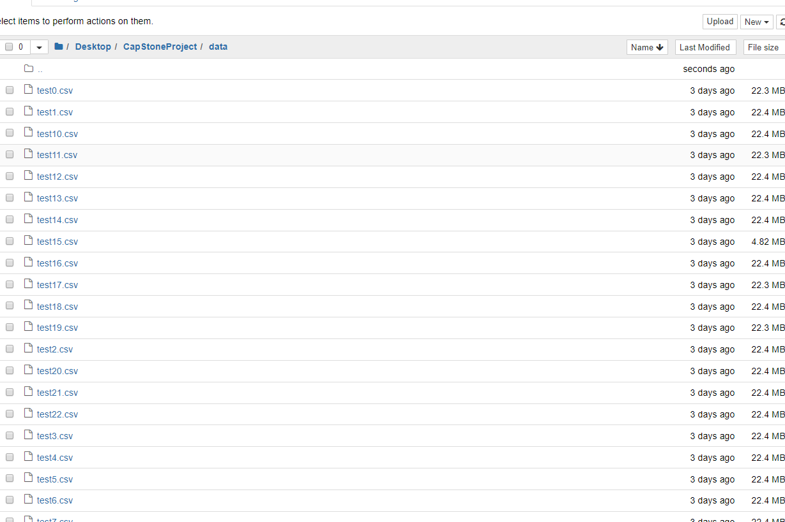

Title: My Fifth Blog
Date: 2020-02-20 11:35
Slug: blog5

### How to upload large files into Git repository?


#### As described on GitHub website -  Git Large File Storage (LFS) replaces large files such as audio samples, videos, datasets, and graphics with text pointers inside Git, while storing the file contents on a remote server like GitHub.com or GitHub Enterprise.

#### ." ..In order to keep the GitHub service performing well for everyone, we don't allow uploading large files (greater than 100MB) inside a Git repository. GitHub Pages is not intended to be used to distribute configuration files, large binaries, or other static assets. There are several low-cost services that are optimized for bulk storage and distributing large files. You can find more information on those services in our help documentation."

#### 1. Download and install the Git command line extension. Once downloaded and installed, set up Git LFS and its respective hooks by running:
#### 2. Select the file types you'd like Git LFS to manage (or directly edit your .gitattributes). You can configure additional file extensions at anytime.
#### 3. Make sure .gitattributes is tracked. Just commit and push to GitHub as you normally would.
#### code below:             (But it did not help me....)


```python
git lfs install

git lfs track "*.psd"

git add .gitattributes

git add file.psd
git commit -m "Add design file"
git push origin master
```

#### For my  assignment data file had over  2mln. records and it total over 500MB (which is not THAT big, but still...). I was able to process data and create the prediction model in Jupiter Notebook, but it was impossible to upload it into Git Hub and Heroku. After some struggle I found  YouTube video posted by Jie Jenn explaining his way of dealing with same issue. It worked for me as well. The idea is to split  your file  into the chunks.


```python
import pandas as pd
import os

chunk_size = 100000           ########## number of records in my chunks.
batch_no = 1

for chunk in pd.read_csv('filePathAndName.csv', chunksize = chunk_size):
    chunk.to_csv('filePathAndName' + str(batch_no) + '.csv', index=False)
    batch_no += 1
```

## Original File:


## Chunked files:


###### I removed after that my original sourse file as well.


```python
os.remove('filePathAndName.csv')
```

#### Now my data was ready to be pushed into GiHub. The questions still left - if I will push it to Heroku, how would I deal with my data splitted over the number of separated files? Another  YouTube video!!!  Posted by Softhints. The solution was just what I was looking for - Loading multiple files into single DataFrame in python. Then process data and load into GitHub and Heroku.


```python
import glob 

```


```python
##Rename multiple csv files in a folder with Python
def rename(dir, pathAndfilename, pattern, tittlePattern):
    os.rename(pathAndfilename, os.path.join(dir, tittlePattern))
```


```python
##search for csv files in the working folderp
path = os.path.expanduser('filepath/*.csv*')
```


```python
##iterate and rename them one by one with the number of the iteration.
#I had to add (try/Except: pass, as after first run I was getting exception, files was renamed already.)
try:
    for i, fname in enumerate(glob.glob(path)):
        rename(os.path.expanduser('filepath/'), fname, r'*csv', r'test{}.csv'.format(i))
except:
    pass
```

## Renamed Files:




```python
result = pd.DataFrame()
```


```python
for  fname in  glob.glob(path):
    head, tail = os.path.split(fname)
    df = pd.read_csv(fname, sep = ',')
    df3 = df.sort_values(by=['ColName'], ascending = True).drop(['ColName'], axis =1)
    df3['channel']= tail
    result = pd.concat([result, df3])
```

## Result - DataFrame


```python
#after that my data frame was ready and I was able to proceed as usual.
df1 = result.drop(['COL1', 'COL2','COL3', 'channel'], axis = 1)
```

#### Of cause there are other ways to deal with large data sets: DASK Dataframe, Vaex- python library for for lazy Out-of-Core DataFrames (similar to Pandas), to visualize and explore big tabular datasets (for string and numbers).  As well as AWS PostgreSQL, known as Postgres, free and open-source relational database management system, which designed to handle a range of workloads, from single machines to data warehouses or Web services with many concurrent users. And some others....

#### The way I described above helped me, hope it will help somebody else.
